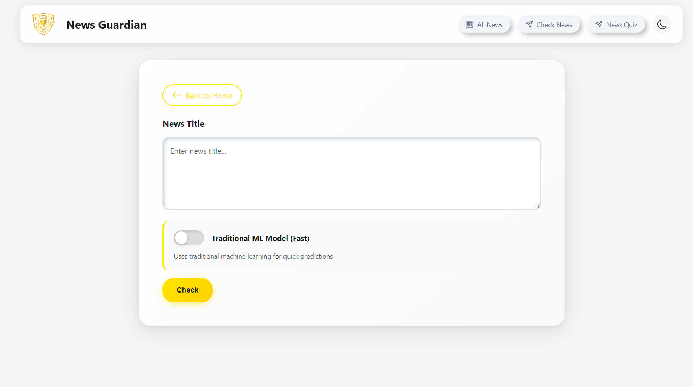

<div align="center">
  
  
  # Fake News Detector
  
  ### AI-Powered News Verification System
</div>

---

## 📖 About

**Fake News Detector (FND)** is an intelligent web application designed to combat misinformation by analyzing news articles using machine learning algorithms. The system provides real-time predictions, helping users identify unreliable news sources and make informed decisions about the content they consume.

This project leverages advanced NLP techniques and credibility scoring to deliver accurate assessments of news authenticity.

## ✨ Features

### 🔴 Live News Monitoring
View real-time predictions for news articles from various sources with credibility scores and fact-check indicators.


### 🎯 News Quiz
Test your fake news detection skills with an interactive quiz featuring real news articles.


### 🔍 Check News by Title
Enter a news headline to instantly receive a prediction on its authenticity.



---

## 🏗️ Architecture

### System Design

```
┌─────────────────┐         ┌──────────────────┐         ┌─────────────────┐
│                 │         │                  │         │                 │
│  React Frontend │ ◄─────► │   Django REST    │ ◄─────► │   ML Model      │
│   (Port 3000)   │   HTTP  │  Framework API   │         │  (scikit-learn) │
│                 │         │   (Port 8000)    │         │                 │
└─────────────────┘         └──────────────────┘         └─────────────────┘
         │                           │                            │
         │                           ▼                            ▼
         ▼                   ┌──────────────┐            ┌─────────────────┐
  ┌──────────────┐          │   SQLite DB  │            │   External APIs │
  │   Browser    │          │              │            ├─────────────────┤
  │   Storage    │          └──────────────┘            │ • Guardian API  │
  └──────────────┘                  │                   │ • SerpAPI       │
                                    ▼                   │ • GROQ Cloud    │
                            ┌──────────────┐            │   (Meta Llama)  │
                            │ Meta4 Scout  │◄───────────┤                 │
                            │  Verifier    │            └─────────────────┘
                            └──────────────┘
```

### Technology Stack

#### Frontend
- **Framework:** React 18.2.0
- **Routing:** React Router DOM 6.15.0
- **UI Components:** React Bootstrap 2.8.0, Bootstrap 5.3.1
- **Icons:** React Bootstrap Icons 1.10.3, React Icons 5.5.0
- **HTTP Client:** Axios 1.5.0
- **State Management:** React Hooks, Context API
- **Caching:** js-cookie 3.0.5
- **Notifications:** React Toastify 9.1.3

#### Backend
- **Framework:** Django 4.2.3
- **API:** Django REST Framework 3.14.0
- **CORS:** django-cors-headers 4.4.0
- **Filtering:** django-filter 24.2
- **Database:** SQLite (included with Django)
- **Machine Learning:** scikit-learn
- **AI Integration:** GROQ Cloud (Meta Llama 4 Scout via groq library)
- **News Search:** SerpAPI (Google News integration)
- **Web Scraping:** BeautifulSoup4, lxml
- **HTTP Requests:** requests 2.32.3

#### Machine Learning & AI
- **Primary Model:** Trained classification model for fake news detection (scikit-learn)
- **AI Enhancement:** Meta Llama 4 Scout via GROQ Cloud for advanced reasoning
- **Features:** NLP-based text analysis, source credibility scoring, cross-reference verification
- **External Intelligence:** SerpAPI for real-time news cross-referencing

---

## 🚀 Installation Guide (Windows)

### Prerequisites

#### Step 1: Install Chocolatey Package Manager

Open PowerShell as Administrator and run:

```powershell
Set-ExecutionPolicy Bypass -Scope Process -Force; [System.Net.ServicePointManager]::SecurityProtocol = [System.Net.ServicePointManager]::SecurityProtocol -bor 3072; iex ((New-Object System.Net.WebClient).DownloadString('https://community.chocolatey.org/install.ps1'))
```

Verify installation:
```powershell
choco --version
```

#### Step 2: Install Python via Chocolatey

```powershell
choco install python --version=3.11.0 -y
```

**Set Python Environment Variables (Automated):**

Run this PowerShell command as Administrator to automatically add Python to PATH:

```powershell
[Environment]::SetEnvironmentVariable("Path", $env:Path + ";C:\Python311\;C:\Python311\Scripts\", [EnvironmentVariableTarget]::Machine)
```

Restart your terminal, then verify Python installation:
```powershell
python --version
pip --version
```

#### Step 3: Install Node.js via Chocolatey

```powershell
choco install nodejs-lts -y
```

Verify Node.js and npm installation:
```powershell
node --version
npm --version
```

#### Step 4: Install Git via Chocolatey

```powershell
choco install git -y
```

Verify Git installation:
```powershell
git --version
```

---

### Project Setup

#### Step 1: Clone the Repository

```powershell
git clone https://github.com/NobinSijo7T/fake-news-detector.git
cd fake-news-detector
```

#### Step 2: Configure External APIs

This project uses external APIs for enhanced news verification:

**1. GROQ Cloud (Meta Llama 4 Scout AI Model)**

- Visit [GROQ Cloud Console](https://console.groq.com/)
- Sign up for a free account
- Navigate to API Keys section
- Create a new API key
- Copy the key (you'll need it for the `.env` file)

**2. SerpAPI (Google News Search)**

- Visit [SerpAPI](https://serpapi.com/)
- Sign up for a free account (100 searches/month free)
- Go to Dashboard → API Key
- Copy your API key

**3. Create `.env` File**

Create a `.env` file in the `app/FakeNewsDetectorAPI/` directory:

```powershell
cd app/FakeNewsDetectorAPI
New-Item .env -ItemType File
```

Add your API keys to the `.env` file:

```env
GROQ_API_KEY=your-groq-api-key-here
SERPAPI_KEY=your-serpapi-key-here
```

**Note:** Replace `your-groq-api-key-here` and `your-serpapi-key-here` with your actual API keys.

#### Step 3: Backend Setup

Navigate to the backend directory and install Python packages:

```powershell
cd app/FakeNewsDetectorAPI
pip install -r requirements.txt
```

**Run Database Migrations:**

```powershell
python manage.py migrate
```

**Load Quiz Data (Optional):**

```powershell
python manage.py quiz_data_loader game_data/game_data.csv
```

#### Step 4: Frontend Setup

Navigate to the frontend directory and install npm packages:

```powershell
cd ../fake-news-detector-frontend
npm install
```

---

### Running the Application

#### Step 1: Start the Backend API

Open a terminal in the project root and run:

```powershell
cd app/FakeNewsDetectorAPI
python manage.py runserver
```

The API will be available at: `http://localhost:8000`

#### Step 2: Start the Frontend

Open a **new terminal** in the project root and run:

```powershell
cd app/fake-news-detector-frontend
npm start
```

The application will automatically open in your browser at: `http://localhost:3000`

If it doesn't open automatically, navigate to `http://localhost:3000` in your browser.

---

## 📦 Package Details

### Backend Dependencies

| Package | Version | Purpose |
|---------|---------|---------|
| Django | 4.2.3 | Web framework |
| djangorestframework | 3.14.0 | REST API toolkit |
| django-cors-headers | 4.4.0 | Handle Cross-Origin Resource Sharing |
| django-filter | 24.2 | Advanced filtering for API |
| scikit-learn | Latest | Machine learning models |
| groq | Latest | GROQ Cloud API client (Meta Llama 4 Scout) |
| serpapi | Latest | SerpAPI client for Google News search |
| requests | 2.32.3 | HTTP library for API calls |
| beautifulsoup4 | Latest | HTML/XML parsing |
| lxml | Latest | XML/HTML parser |
| psycopg2-binary | Latest | PostgreSQL adapter (optional) |

### Frontend Dependencies

| Package | Version | Purpose |
|---------|---------|---------|
| react | 18.2.0 | UI library |
| react-dom | 18.2.0 | React DOM renderer |
| react-router-dom | 6.15.0 | Client-side routing |
| axios | 1.5.0 | HTTP client |
| bootstrap | 5.3.1 | CSS framework |
| react-bootstrap | 2.8.0 | Bootstrap components for React |
| react-bootstrap-icons | 1.10.3 | Icon library |
| js-cookie | 3.0.5 | Cookie management |
| react-toastify | 9.1.3 | Toast notifications |
| react-scripts | 5.0.1 | Build tooling |

| react-scripts | 5.0.1 | Build tooling |

---

## 🤝 Contributing

Contributions are welcome! If you have ideas for new features, improvements, or bug fixes:

1. Fork the repository
2. Create a feature branch (`git checkout -b feature/AmazingFeature`)
3. Commit your changes (`git commit -m 'Add some AmazingFeature'`)
4. Push to the branch (`git push origin feature/AmazingFeature`)
5. Open a Pull Request

## 🗺️ Roadmap

- [ ] Enhanced ML models with deep learning (LSTM/BERT)
- [ ] User authentication and profiles
- [ ] Track quiz scores and progress
- [ ] Browser extension for real-time news verification
- [ ] Multi-language support
- [ ] Advanced source credibility analysis
- [ ] API rate limiting and caching

## 📝 License

This project is licensed under the MIT License - see the [LICENSE](LICENSE) file for details.

## 📧 Contact

For questions, suggestions, or issues:

- **Email:** [dark_agent_437@protonmail.com](mailto:dark_agent_437@protonmail.com)
- **Issues:** [GitHub Issues](https://github.com/NobinSijo7T/fake-news-detector/issues)

---

<div align="center">
  <strong>Together, we can fight misinformation!</strong>
  
  Made with ❤️ by developers committed to truth and transparency
  
  ⭐ Star this repo if you find it useful!
</div>
